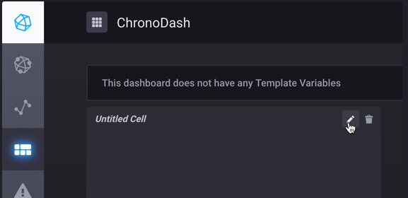
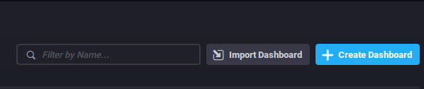

# Using terraform with docker to build a TICK stack

### Background:
I got bored one night and really wanted to if it hard to use docker with terraform instead of just running the `docker` commands.  After a while I really like the terraform state with docker because I could make a small change and re-run `terraform apply` to make a correction.  

## Requirements
1. Terraform
2. Docker

## Getting started
Clone the repo https://github.com/digikin/tf-docker-tick_stack.git and change into the directory.  
You will have to change the `locals` variable on line 76 to whatever your absolute path is in your environment. 

## Commands

1. `terraform init`
2. `terraform plan`
3. `terraform apply` then type yes -> `Enter a value:` `yes`

## Chronograf and dashboards
I have telegraf configured to pull all the docker metrics but I couldn't figure out how to automatically get the `docker.json` dashboard to autopopulate. 
### Visit
 http://localhost:8888  
   
 Click the dashboard button on the left menu.
   
   
   
 Select `Import Dashboard` at the top right menu.
   
 
  
 Upload the `docker.json` file included in the repo under `tf-docker-tick_stack/config/docker.json`
  
 Enjoy!!

 

